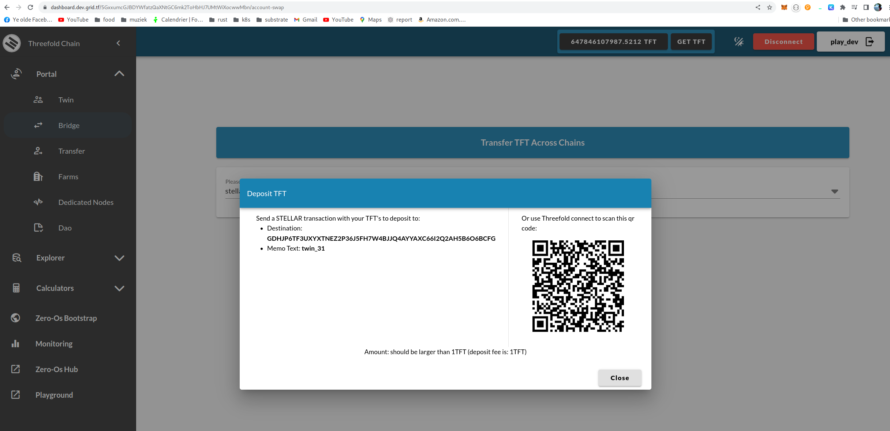

# Transferring TFT between Stellar and Tfchain

## Usage

This document will explain how you can transfer TFT from Tfchain to Stellar and back.

## Prerequisites

- Stellar wallet
- Account on tfchain (use dashboard to create one)

## Stellar to Tfchain

You can deposit to Tfchain using the bridge page on the dashboard, click deposit:

## Tfchain to Stellar

You can bridge back to steller using the bridge page on the dashboard, click withdraw:

A withdrawfee of 1 TFT will be taken, so make sure you send a larger amount as 1 TFT.
The amount withdrawn from Tfchain will be sent to your Stellar wallet.
