## Dashboard
The dashboard is a unified admin interface for everything related to Threefold Grid such as:

- **Portal**
  - Twin management
    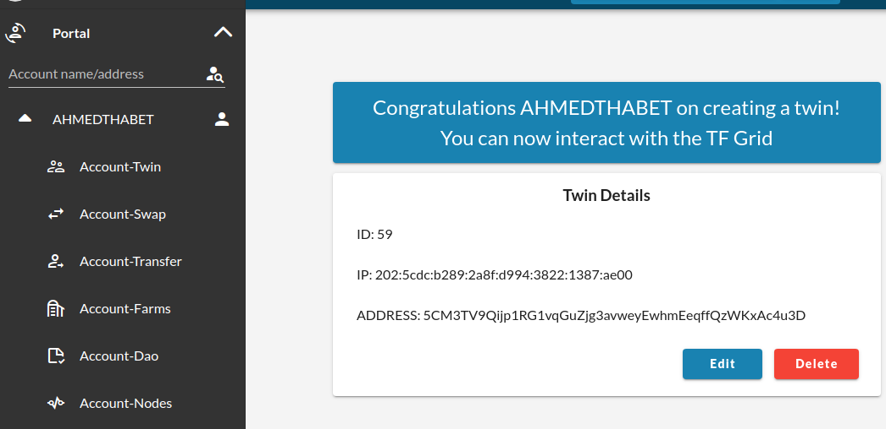
  - Swapping with Binance and Stellar
    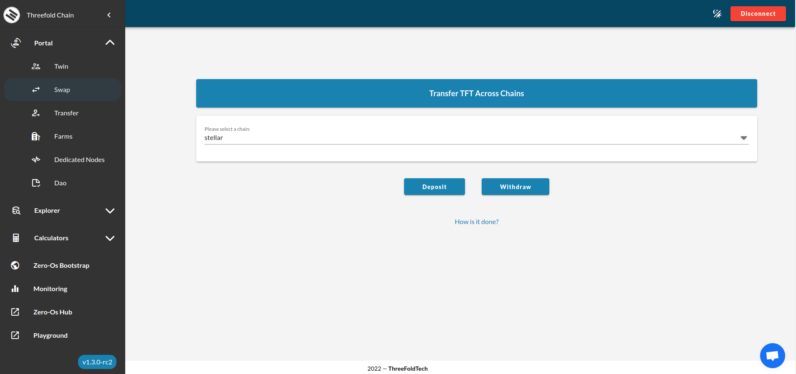
  - Transferring money to other tfchain user
    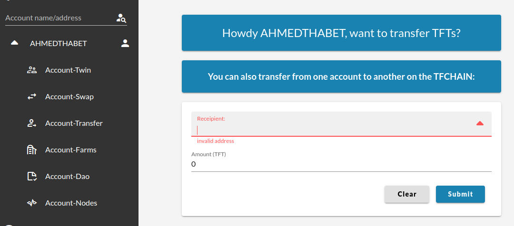
  - Farms management
    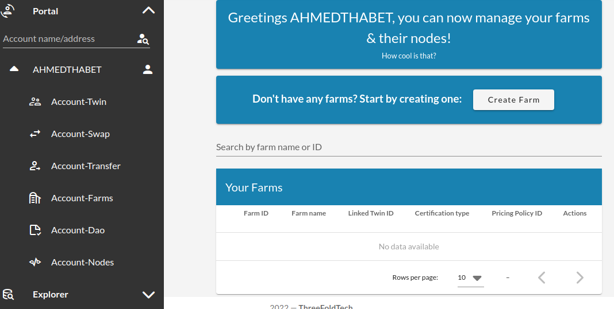
  - Dedicated Nodes
    Rent a whole node to deploy your solutions on. [Dedicated Nodes](portal/dashboard_portal_dedicated_nodes.md)
    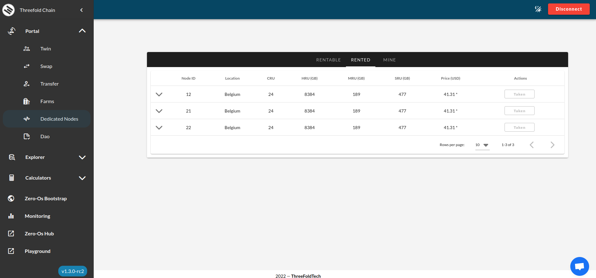
  - TFChain DAO
    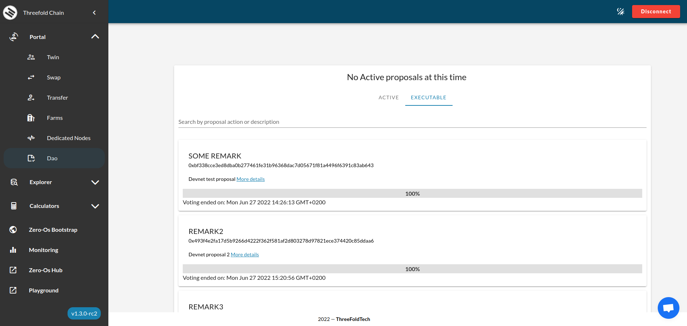

- **Explorer**
  - Grid statistics
  
  - Exploring Threefold nodes
  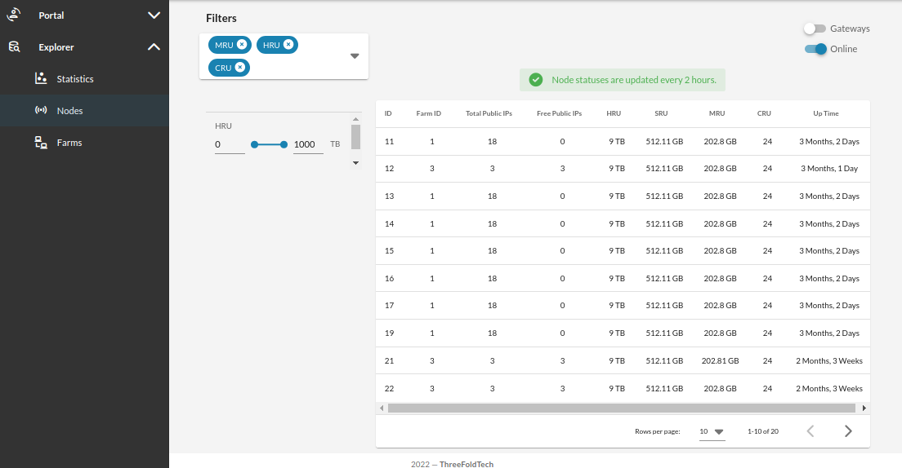
  - Exploring farms
  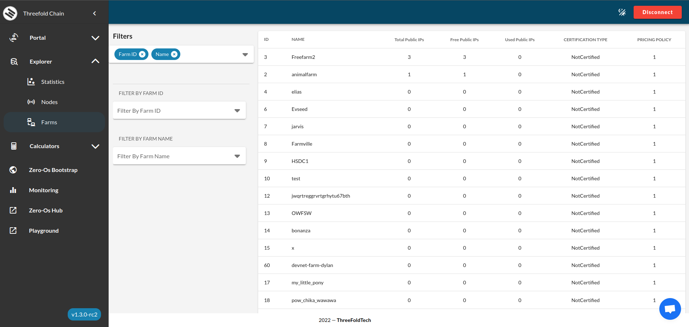

- **Calculators**
  - Resource pricing | [*Threefold Pricing*](https://library.threefold.me/info/threefold/#/tfgrid/pricing/threefold__pricing)
  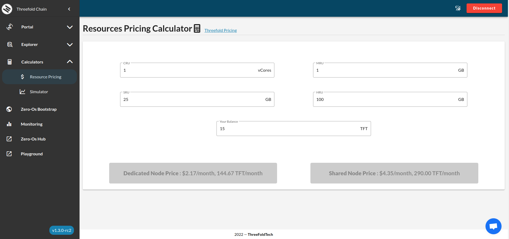
  - Resource pricing 
  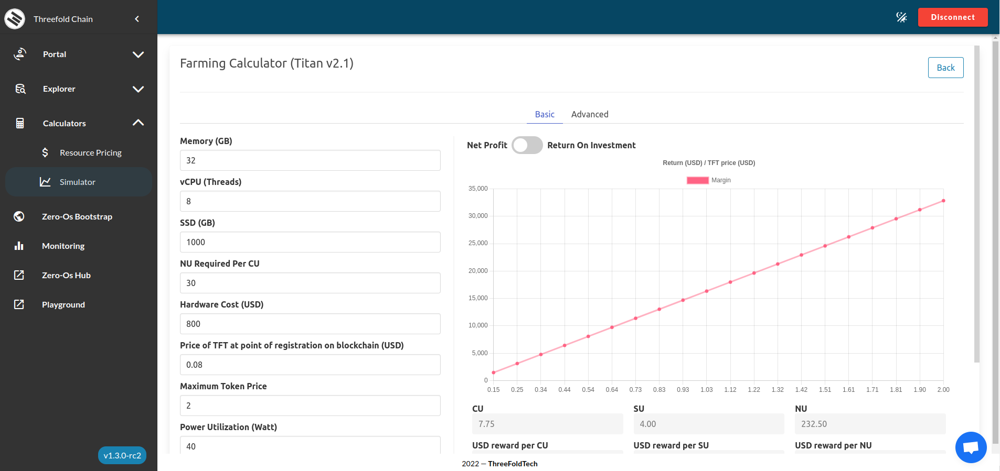

- **Zero-Os Bootstrap**
  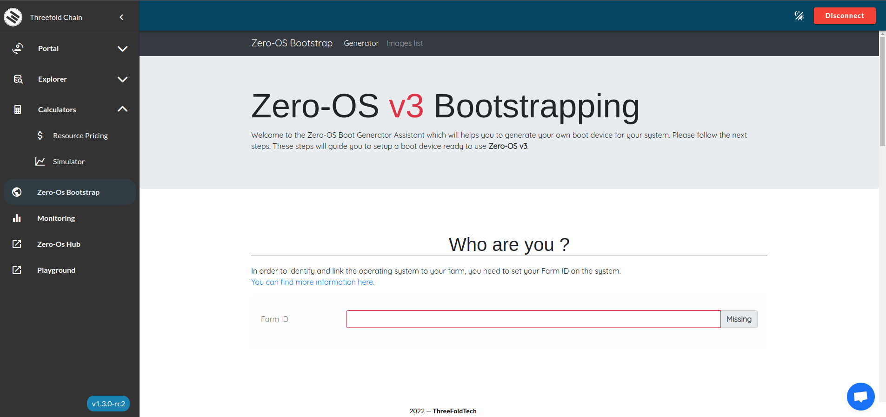