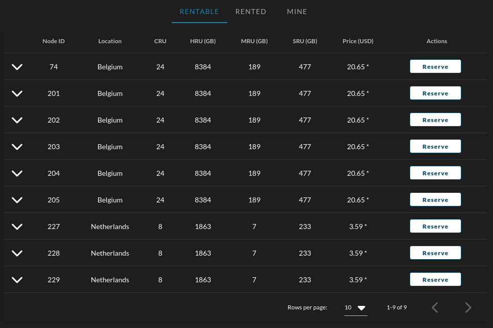
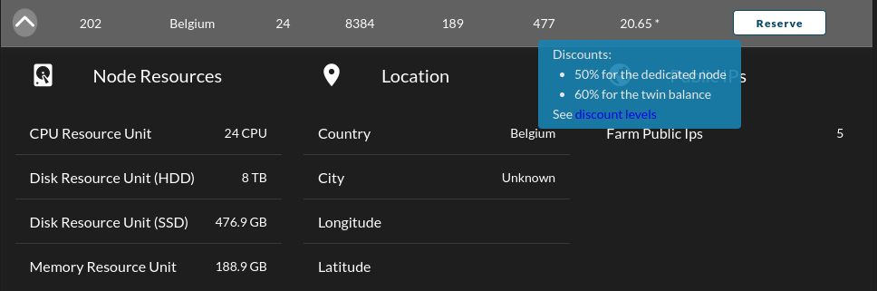
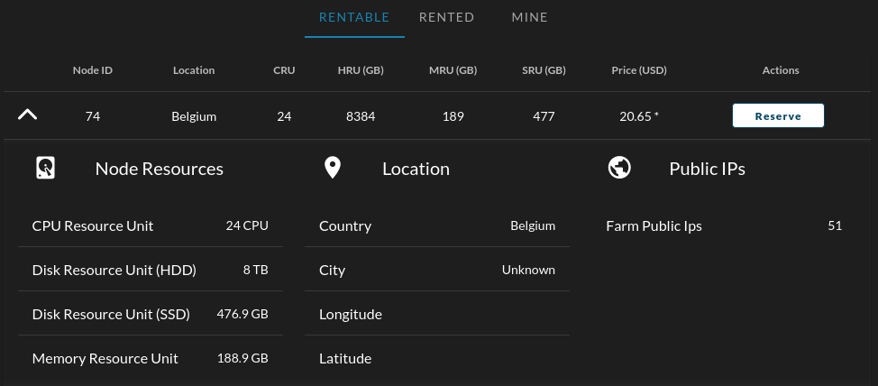
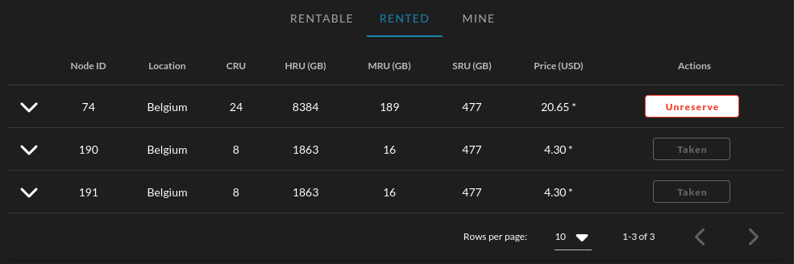
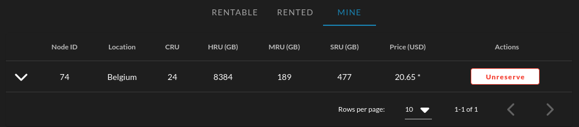

## What is Dedicated Node?

A user can reserve an entire node then use it exclusively to deploy solutions.

### Discription

- Node reserved with deploying a `RentContract` on this node. node can has only one rentContract.
- When a user create a RentContract against a node, the grid validate that there are no other active contracts on that node on the creation.
- Once a RentContract is created, the grid can only accept contracts on this node from the tenant.
- Only workloads from the tenant are accepted

### Billing & Pricing

- Once a node is rented, there is a fixed charge billed to the tenant regardless of deployed workloads.
- Any subsequent NodeContract deployed on a node where a rentContract is active (and the same user is creating the nodeContracts) can be excluded from billing (apart from public ip and network usage).
- Reserved Disounts for renting a node on TFGrid internet capacity
  - 70% for dedicated node (TF Pricing policies)
  - a second level discount up to 60% for balance level see [Discount Levels](https://library.threefold.me/info/threefold/#/tfgrid/grid/pricing?id=discount-levels)

### Which nodes are available for dedicated rental contracts

At the moment there are 2 ways a server is made available as a dedicated servers?

- The farm is marked as "dedicated only" by the council. In this case, all nodes in the farm are marked such that they can only be fully rented. This means that the node will not accept simple virtual machine or other flist based deployments.  Currently on mainnet no such farm exists. 
- Introduced in version 3.7.1 a rent contract can be deployed on "applicable nodes". An applicable node is simply an "empty" node, i.e. one which does not have any active contract. This way, a user can choose to fully reserve the node if nothing is there yet.

There is no direct control from the farmer (in the first case the farmer could ask the council to mark him as dedicated only, but that is unlikely to happen). In other words, all farmers implicitly support dedicated nodes now.

### Usage

- See list of all rentable node on `Rentable` tab in the dedicated nodes table.

    
  - Hover on price to see discount
    
  - Expand row to see more info on the node:
  
    
    - Resources
    - Location
    - Possible Public Ips *this dependes on the farm it belongs to*

  - You can see the nodes in 3 states:
    - Free
    - Reserved *Owned by current twin*
    - Taken *Owned by another twin*
  - You can check the nodes with each of these states in its separate tab.
    - Rentable
      This tab shows all of the nodes that can be rented.
      
    - Rented
      This tab shows all of the nodes that are rented by you or by other users.
      
    - Mine
      This tab shows nodes that are only rented by you.
      
- Reserve a node:
  - If node is not rented by another twin you can simply click reserve.
  - Type your password on the polkadot pop up window.
  - Wait for the pop up message said `Transaction succeeded`

    
  - The node should disappear from the `Rentable` tab.
  - The node should appear in both the `Rented` & `Mine` tabs

- Unreserve a node:
  - Simply as reserving but another check will be done to check you don't have any active workoad on the node before unreserving.
  - The node should disappear from both the `Rented` & `Mine` tabs and should reappear in the `Rentable tab`
