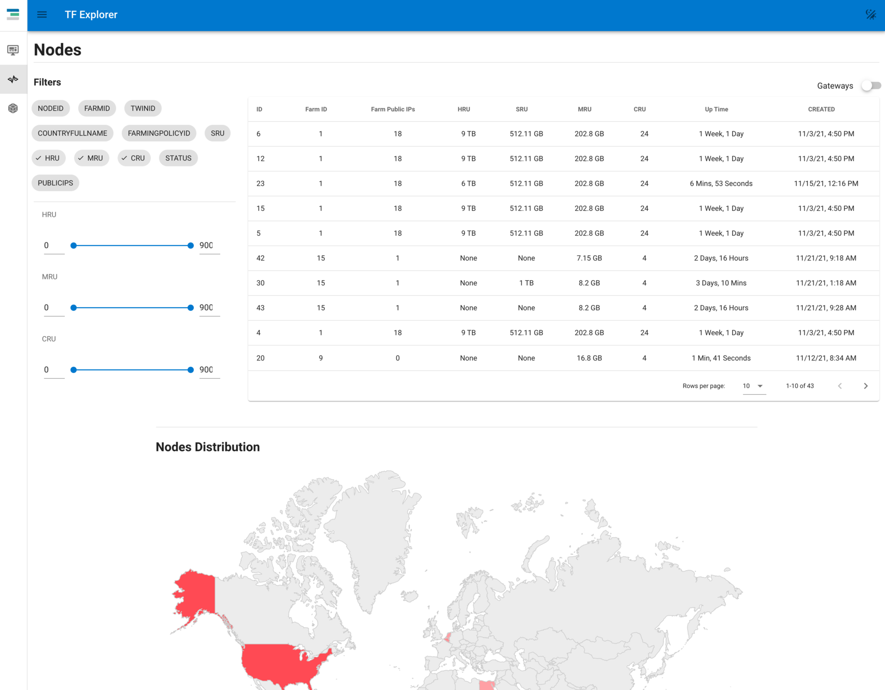
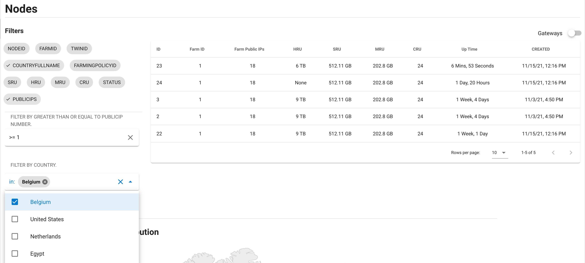
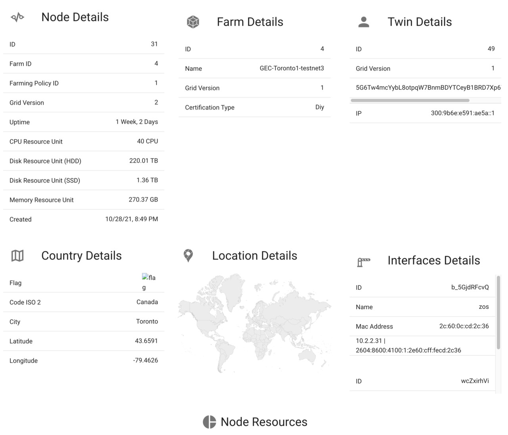

# Find Capacity on the Grid



Before you can deploy on the TFGrid you need to find a node which fits your requirements.

## Use the explorer you need for your chosen tfgrid net.

!!!include:explorer_list

## Use filter to select Country & Requirement for Public IP's



In this case 5 nodes are found with that requirement.

Do note you have to put

- ```>=1``` in the publicip's part, means at least one public ip address.

Remember the ID, this is the number you will need to specify your node.

## Important

- make sure there is enough capacity on the node for your workload requirements
- make sure you use the right explorer, each net has a different explorer.

## Node details


