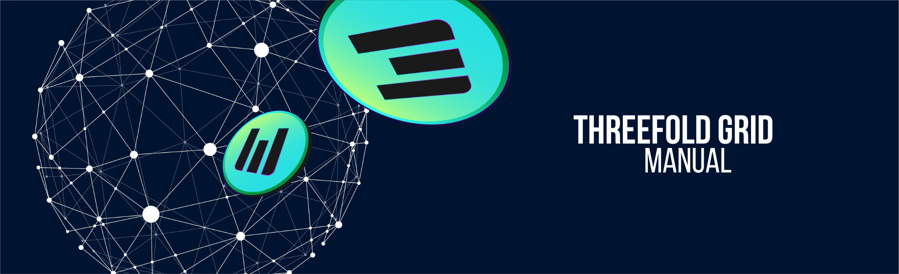

# Get Started

<!-- ## What do you need to know?

- [The Basic Concepts of TFGrid 3.0](tfgrid3_what_to_know) -->

## Get Started - Farmers

- [Create a Farm](create_farm)

## Get Started Your First Virtual Machine

!!!include:getstarted_toc

## Grid Concepts

- [TFGrid Primitives](tfgrid_primitives)
- [Grace Period](grace_period)
- [Buying TFT](tft_howtos)

## Grid Platforms

- [TF Dashboard](dashboard_readme)
- [TF Portal](dashboard_portal_home)
- [TF Explorer](explorer_home)
- [TF Flist Hub](flist_hub)
- [TF Playground / Weblets](weblets_home)

## Grid Services and Data Sources

- [TFGrid Services](Manual3_tfservices)

## Advanced Deployment Techniques (Terraform)

- [Terraform](terraform_home)
- [Advanced Topics](advanced)

