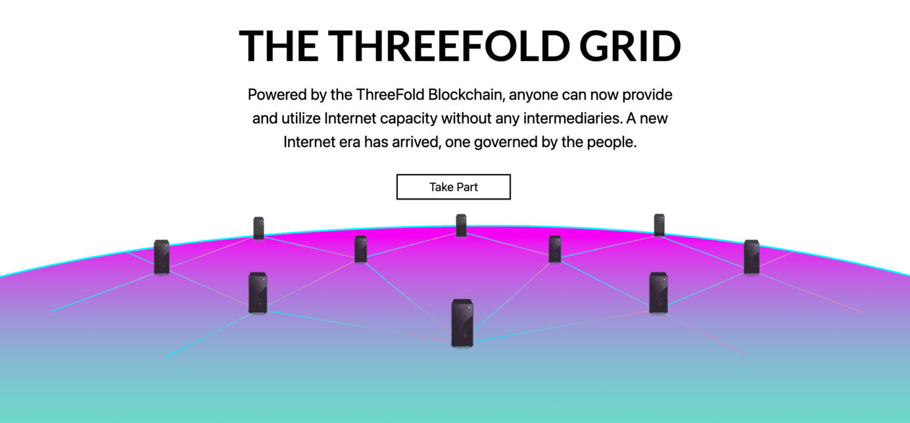

<!--  -->

<!--  -->

# Manual TFGrid 3.0

Welcome to **ThreeFold Grid 3.0 Manual**!

This manual contains updated information and guides on development tools, components, resources, as well as guides on how to operate different functionalities and tools in the ThreeFold Grid 3.0.

## Development Guide

### About ThreeFold Grid 3.0

Get to know about the latest improvements and technologies of ThreeFold Grid 3.0

- [**What's New**](grid3_new)
- [**Definitions**](grid3_definitions)
- [**Proof of Utilization**](proof_of_utilization_manual)

### Learn the Basics

Learn about ThreeFold Grid's primitives in depth.

- [**ThreeFold Grid Primitives**](threefold:tfgrid_primitives)

### Get Started

High level overview on getting started and run ThreeFold Grid 3.0.

- [**Get Started**](tfgrid3_getstarted)

## Help Improve This Manual

**ThreeFold Grid 3.0 Manual** is is a open-sourcedocumentation project currently maintained by ThreeFold Foundation's internal team, and constantly undergoes evolving documentation phases. Help us improve this manual. Documentation grants are available for external documentary contributors. Contact **info@threefold.io** for more information on how to become a contributor. 