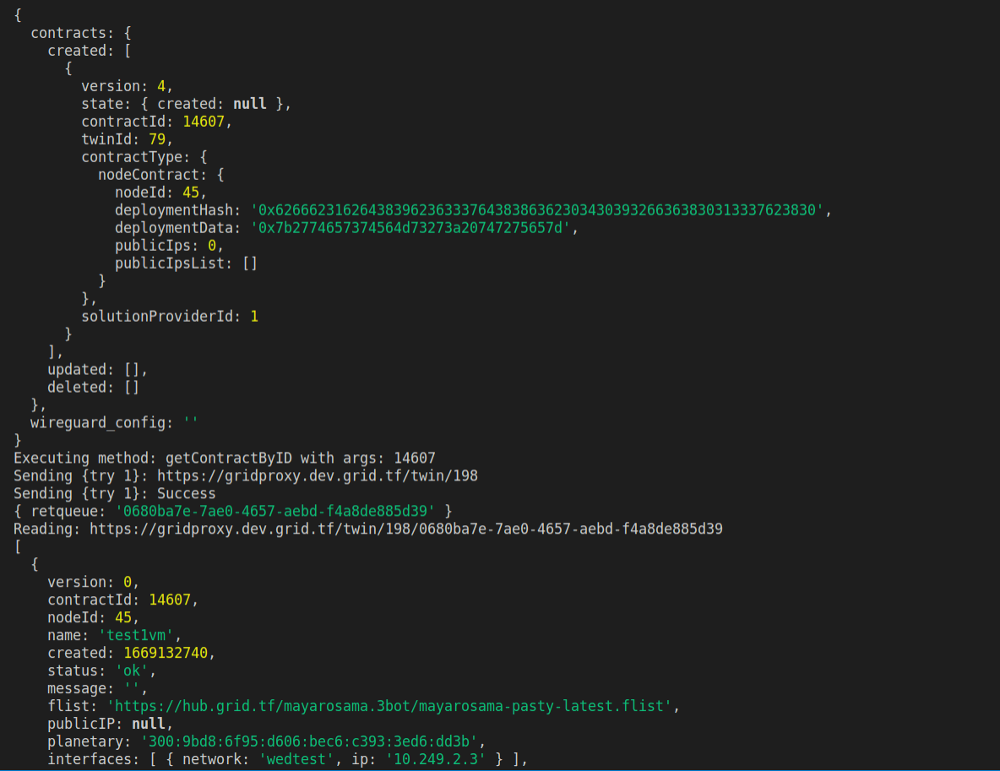

# How to use the solution provider with your deployments?

After fllowing the step for creating your solution provider as mentioned [here](solution_provider.md).

You can now add the solutionProviderId to your deployment as follows:

- ### Grid3_client
```bash
vm.solutionProviderID= solutionProviderID;
```
This should be added your deployments as shown bellow


After deployment the machine, The solutionProviderID will be shown in the machine specs

