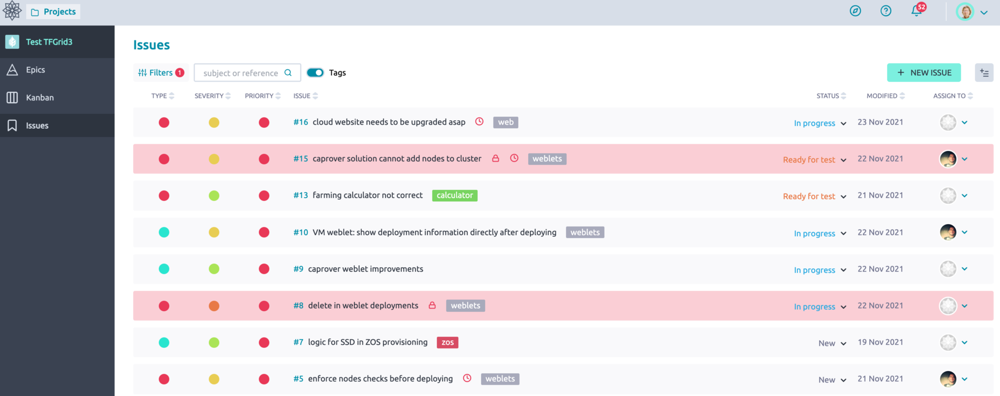
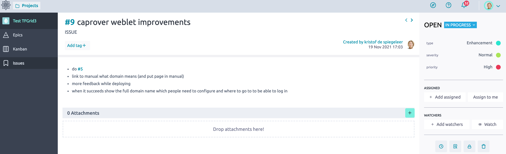

> IMPORTANT NOTICE (05/03/2023): 
The information of this page is outdated. ThreeFold team is in the process of migrating this this manual to its new home on manual.grid.tf. Please go to [manual.grid.tf](https://manual.grid.tf/) to read the latest documentation of ThreeFold.

# Report Feature Request and Issue

Please use our circles to to report issues and or feature requests.

> [Circles Tool](https://circles.threefold.me/project/test-tfgrid3/issues?exclude_status=2212&order_by=-priority)

> TODO: (high) need more description how to file an issue