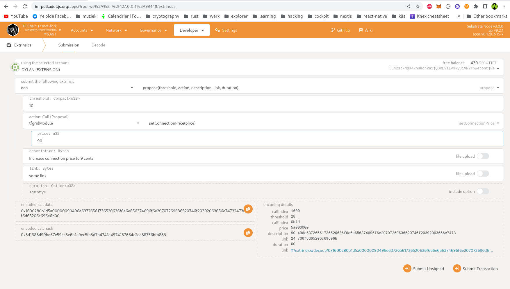
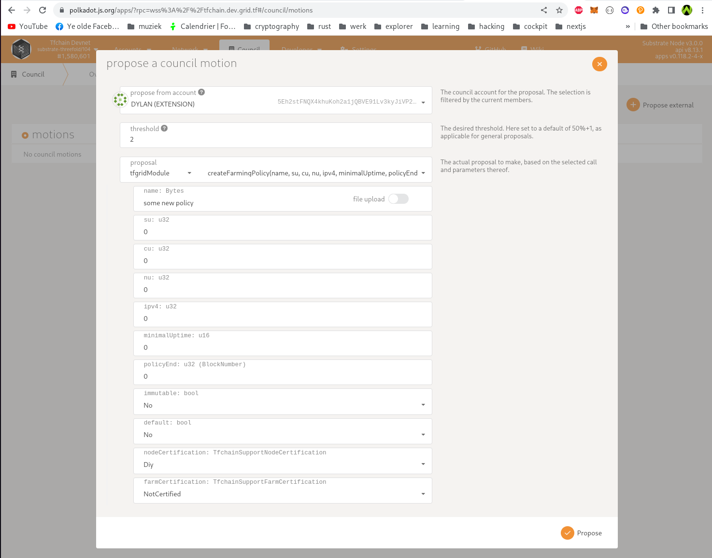

# TF Chain DAO (decentralised autonomous organisation)

The DAO on TF Chain was created with the intent to give Farmers voting right on chain. The Council (TF Grid Guardians) can create proposals where Farmers can vote upon.

## Council

A council member is a person with slightly elevated privileges, represented by an account on chain. It is intended that this person acts in the interest of the grid/chain. There can be at most 12 council members at once (though this should be configurable in the code). A council member has the following abilities on chain:

- Create a new voting proposal.
- Link an existing farming policy to a farm, with suggested limits (see farming policy section).
- Council only vote (nobody except council member can vote for this) to add or remove a member. For the result of this vote, strict majority is used, i.e. vote passes if votes_for > votes_against. There must also be a time limit on the vote, any council member who doesn't vote before this time implicitly abstains. Note that in case of removal, the member to be removed can vote against that (no special logic to prevent this).
- Set the certification level of a farm (see bellow).

## Certified node verifier

This is an entity (person, group, ...), represented on chain by an address, which can mark an existing node as certified. Adding addresses to this list is done through a regular vote. Any address in this group can mark any node as certified (and unmark a node as well). The Council can propose an entity to be added as a Node Certifier, this will most likely be an entity who sells hardware to expand the TF Grid. A node Certifier can mark a Node as certified so that the Node received additional rewards every minting period.

## Cerfified farms

A Farm is either `NotCertified` or `Gold`. The DAO can propose that a certain farm get's marked as `Gold` if it has a certain farming setup.

The rules for Gold Farm Certification are:

- Hardware purchased from a recognized vendor (approved by DAO - initially HPE & ThreeFold itself)
- Minimum 5 IPv4 addresses per server
- Two power supplies
- Two routers per rack
- Two Internet Service Provider connections
- Tier 3 or 4 data center certified to ISO 27001
- Uptime 99.8%
- Network connection at least 1GBit/sec
- Geographic decentralization - no more than one full datacenter rack per town unless and until utilization in that rack is > 50%.
- The 3Nodes need to be certified (can be done by TFTech or other actors on blockchain)

Once a Farm is marked as `Gold` certified, all the nodes in that farm receive additional rewards (50% more farming rewards and better SU calculation price).

See [GEP](https://forum.threefold.io/t/gep-gold-certified-farming-specs/2925)

## Voting

### Voting weight

As mentioned anyone can vote. Vote weight is caculated as following:

Weight of a farm is 2 \* (sum of CU of all nodes) + (sum of SU of all nodes)

We weight votes because it makes sense that a larg farmer in the system has more "say" than a small one.

### Voting process

First, a council member needs to suggest a proposal (see below for valid topics). Once a proposal is submitted it can be voted on by farmers (technically everyone can vote, but if an address attempts to vote with no attached farms, or no nodes in the farm i.e. weight 0, an error should be returned to indicate this). The exception are council members. 3 council "no" votes will veto the proposal. If a member of the council, without farm, votes no, the no vote needs to be stored. On 3 no votes the proposal is automatically closed. Should this happen, an event should be emitted declaring a council veto, with the address of the no voters. Otherwise, if the time limit on the proposal is reached, a simple majority decided (vote weight for > vote weight against). Anyone who does not vote before the proposal is closed is implied to abstain, and does not contribute. Lastly, a minimum number of votes can optionally be set. In this case, it is the number of farms that need to vote. If by the end of the vote the amount of votes is not reached, the vote fails due to insufficient interest. Only votes made by actual farm(er)s are counted for this.

After the vote is closed (assuming it is not veto'd by the council), we first check if sufficient farms have voted. This is done by simply counting the farms voting in favor and the farms voting against, and checking if this sum is greater than or equal to the configured minimum votes in the proposal.
If it is a chain action, it should automatically be executed after the vote passes.
Importantly all proposals have a description.

### Possible proposals:

- Change pricing rules (i.e. change the active pricing policy).
- Add a new farming policy.
- Change an existing not immutable farming policy.
- Upgrade for the chain.
- Add a certified node validator.
- Remove a certified node validator.
- Spend from the treasury.
- Register a new solution
- Delete an existing solution
- "Generic" proposal, this is not reflected on the grid, but rather just something with a description.

### Changing connection price

### Creating a farming policy

Price expressed in Musd (usd * 1000)

