## [Threefold Hub](https://tfhub.test.grid.tf/)

### Required Plugins

**[Metamask](https://metamask.io/)**

You will need to install Metamask plugin and connect it to the Binance Smart Chain.
[Here](https://academy.binance.com/en/articles/connecting-metamask-to-binance-smart-chain) is a tutorial on how to install Metamask and connect it to **BSC**. Follow the instructions and to create your wallet and save your Recovery Phrase in a safe place.

**[Keplr](https://www.keplr.app/)**

You will need to install Keplr plugin to connect to the threefold hub chain.
install the chrome plugin from [here](https://chrome.google.com/webstore/detail/keplr/dmkamcknogkgcdfhhbddcghachkejeap)  and follow the instructions to create your account and save your Mnemonic seed in a safe place.

### Adding the chains to each plugin

**[Metamask](https://metamask.io/)**

Follow the instructions available [here](https://academy.binance.com/en/articles/connecting-metamask-to-binance-smart-chain) on how to connect to Binance Smart Chain **BSC**. 

**[Keplr](https://www.keplr.app/)**

- When you try to access [Threefold Hub](https://tfhub.test.grid.tf/) with Keplr installed you will be asked if you want to add the Threefold hub chain to keplr. 

   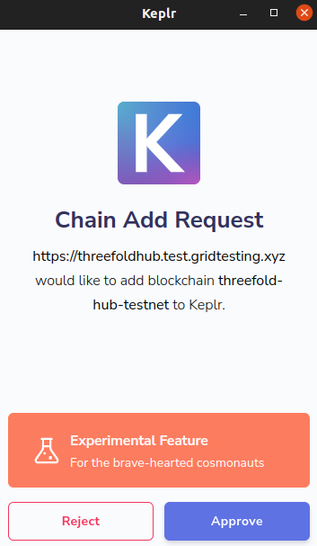

- Approve the request and open keplr. On the top you will find a drop down menu where you can change the chain.

   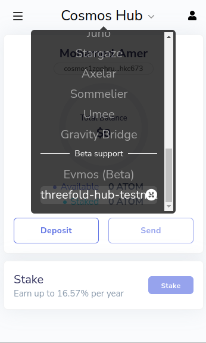

- Choose threefold-hub-testnet.

### Adding Tokens to the plugin

**BSC**

- After receiving the tokens you will need to go to [BSC Explorer](https://testnet.bscscan.com/) and enter your BSC address in the search bar. (You can copy your BSC address from Metamask).
- After Searching, from the Tokens drop down menu choose the desired token (TFT in our case).

   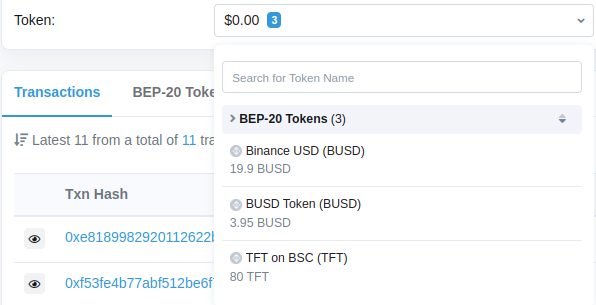

- You will find a contract address copy it.

   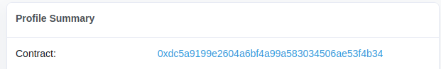

- Open Metamask, scroll down and click on import tokens.

   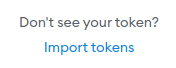

- Enter the address you copied from the explorer in the Token Contract Address field. (The other fields will be filled automatically).

   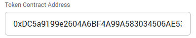

- Click Add Custom Token and confirm.

### Sending Tokens from BSC to Threefold Hub

- Open [Threefold Hub](https://tfhub.test.grid.tf/).
- Click on SEND TO THREEFOLD HUB.
- Enter the desired amount.
- Enter your Threefold Hub address (You can copy it from Keplr).

   

   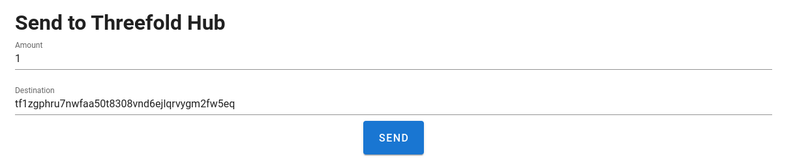

- Click Send.
- Metamask will ask you to confirm the transaction.

   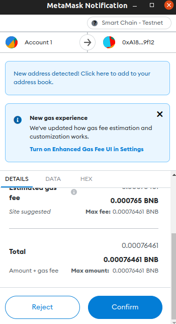

- Confirm it.
- Within a few minutes the TFT will appear in your Keplr Wallet.

### Sending Tokens from Threefold Hub to BSC

- Open [Threefold Hub](https://tfhub.test.grid.tf/).
- Click on SEND TO BSC.
- Enter the desired amount.
- Enter your BSC address (You can copy it from Metamask).

   

   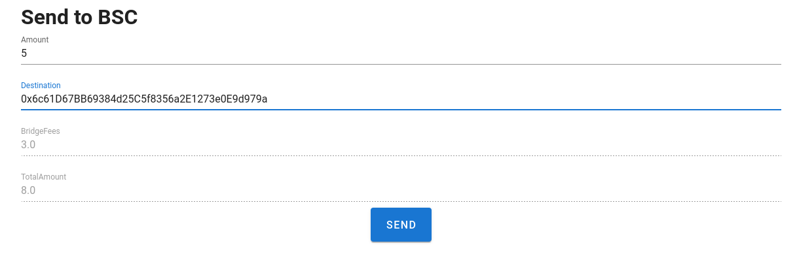

- Verify that you have enough TFT after checking the total amount with the transaction fees.
- Click Send.
- Keplr will ask you to confirm the transaction.

   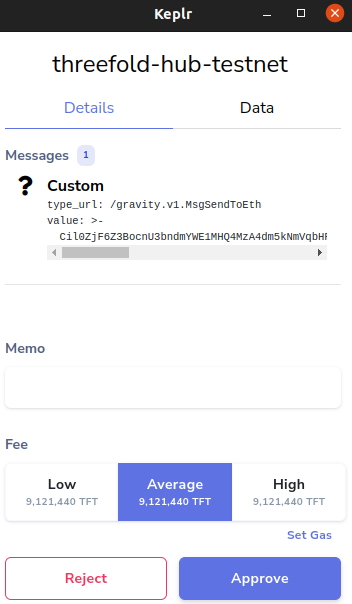

- Confirm it.
- Within a few minutes the TFT will appear in your Metamask Wallet.
- You can check the your transactions by clicking on the PENDING BSC TRANSACTIONS button.
- You can cancel your transaction if it is in the unbatched tab.

   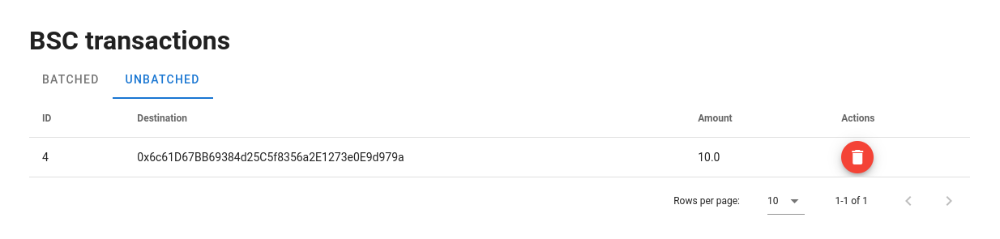

- Once the transaction is batched you can't cancel it.

   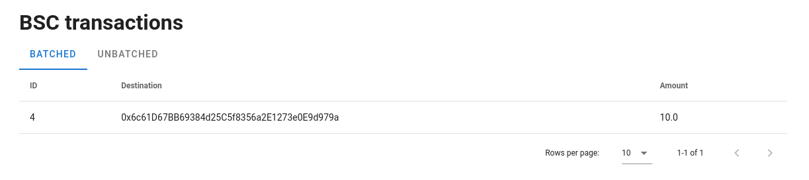

### Creating Proposals (Text)

- Open [Threefold Hub](https://tfhub.test.grid.tf/).
- Click on ADD PROPOSAL.
- Enter the Title, initial Deposit, Description.

   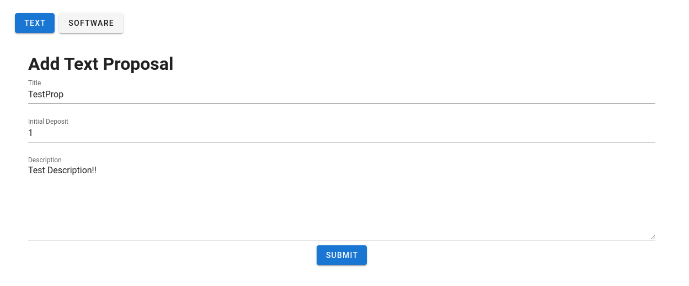

- Click Submit.
- Confirm The transaction from Keplr.
- Click on PROPOSALS.
- You can see your added proposal in the proposals list.

   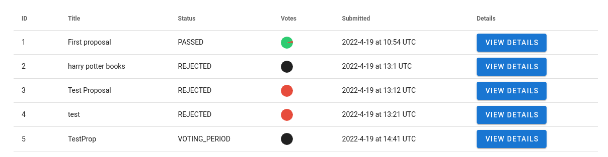
   

### Creating Proposals (Software)

- Open [Threefold Hub](https://tfhub.test.grid.tf/).
- Click on ADD PROPOSAL.
- On the top left corner Click on SOFTWARE

   

- Enter the Title, Description, Name, initial Deposit, Height, Operating Systems.

   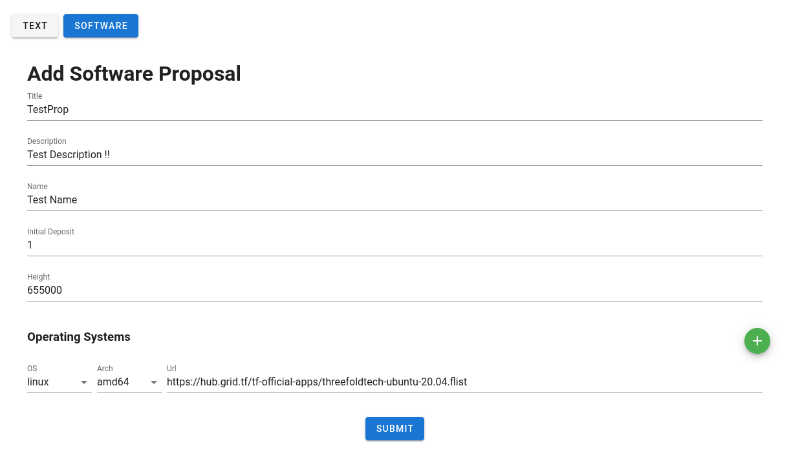

- Click Submit.
- Confirm The transaction from Keplr.
- Click on PROPOSALS.
- You can see your added proposal in the proposals list.

   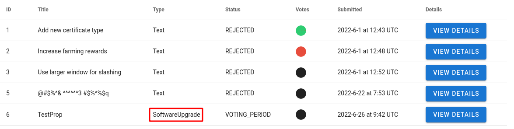

### Listing Proposals

- Open [Threefold Hub](https://tfhub.test.grid.tf/).
- Click on PROPOSALS.

   

- You can see available Proposals in the Proposals List.

### Voting for Proposals 

- Open [Threefold Hub](https://tfhub.test.grid.tf/).
- Click on PROPOSALS.
- In the Proposals list select any proposal that has a status of `VOTING_PERIOD`.

   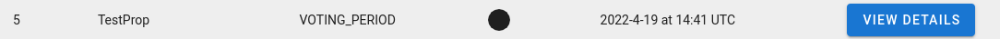

- Click on the VIEW DETAILS button for the mentioned proposal.
- Select your vote.

   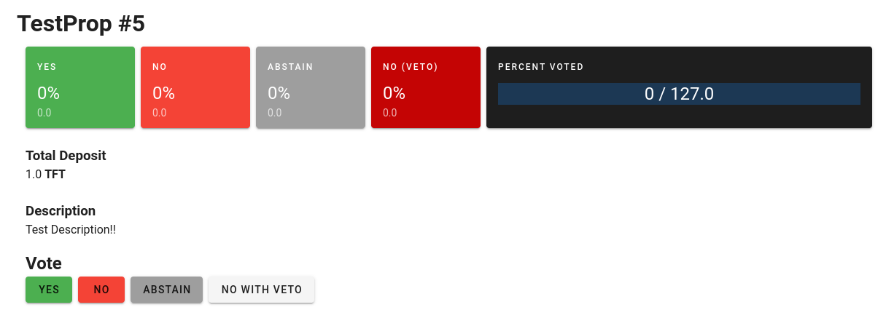

- Confirm the transaction from Keplr.
- You can see that your vote was recorded and reflected in the statistics.

   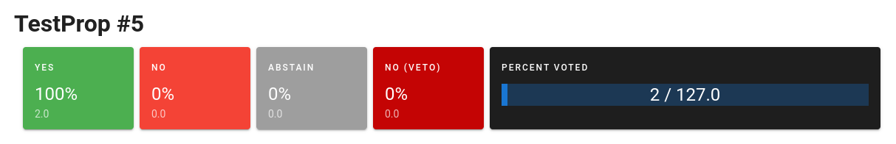

### Listing Validators

- Open [Threefold Hub](https://tfhub.test.grid.tf/).
- Click on VALIDATORS.
- You can see available Validators in the Validators List.

   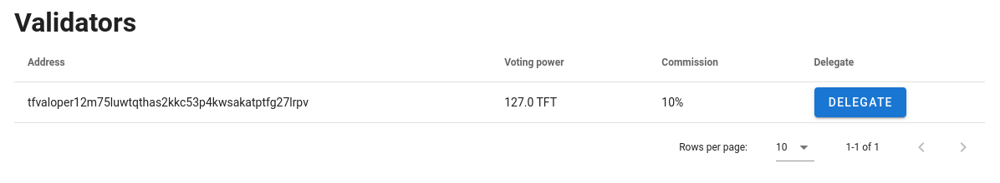

### Delegating tokens to a validator

- Open [Threefold Hub](https://tfhub.test.grid.tf/).
- Click on VALIDATORS.
- Click on the DELEGATE button for the desired validator.

   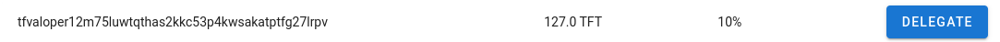

- Enter the desired amount in the Amount field.
 
   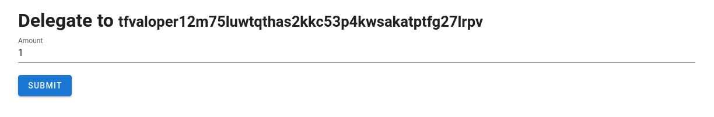

- Click submit.
- Approve the transaction from Keplr.
- You can see that the voting power for the validator increased with the amount of TFT delegated.

   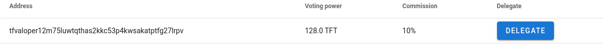

