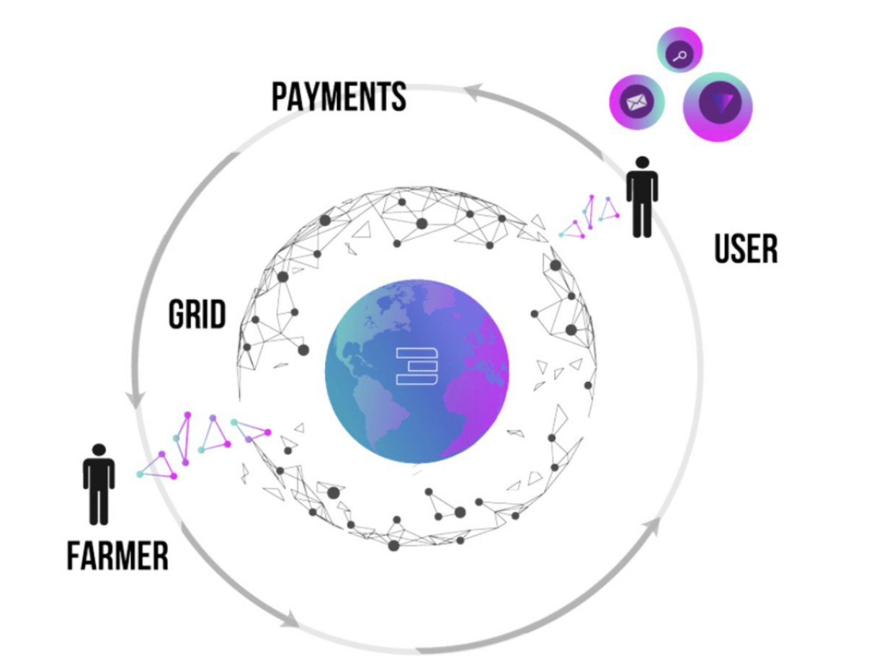

# TFT Ecosystem Manual

This is a compilation of tutorials and manuals regarding [__TFT Ecosystem__](@threefold:tft_ecosystem), including how to buy, to trade, and to store your TFTs.

For a complete introduction of TFT, please refer to [__ThreeFold Library's TFT Home Section__](@threefold:tokens_home).

## Manuals on How to Buy TFT

How to buy TFTs on different platforms

- [Buy TFTs on Binance Smart Chain using Pancake Swap Protocol](@threefold:tft_binance_defi.md)
- [Buy TFTs on Binance Smart Chain using 1inch.io](@threefold:tft_1inch)
- [Buy TFTs on GetTFT.com](https://gettft.com/gettft/#how-it-works)
- [Buy and Store TFTs using TFConnect App](@threefold:_tft_buy_tfconnect.md)
- [Buy and Store TFTs using Solar Wallet](@threefold:solar_wallet)
- [Buy and Store TFTs inside Lobstr Wallet](@threefold:lobstr_wallet)
- [Buy and Store TFTs on StellarTerm](@threefold:tft_stellarterm)
- [Buy and Store TFTs on Interstellar](@threefold:tft_interstellar)
- [Buy TFTs on BTC-Alpha Exchange](@threefold:tft_btc_alpha)
- [Buy TFTs on StellarX Exchange](@threefold:tft_stellarx)
- [Buy TFTs from TF Live Desk (OTC)](@threefold:tft_otc)
- [Buy TFTs from Mazraa (Farmers)](@threefold:tft_mazraa)
- [Buy TFTs from Bettertoken (Farmers)](@threefold:tft_bettertoken.md)

## Other Related Manuals on TFT

- [Store TFTs on Hardware Wallets](@threefold:tft_howtos_hardware.md)
- [Bridge TFT between Stellar and Binance Smart Chain](@threefold:tft_bsc_bridge)
