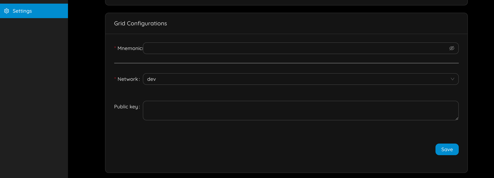
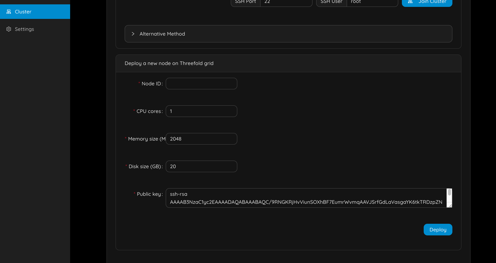
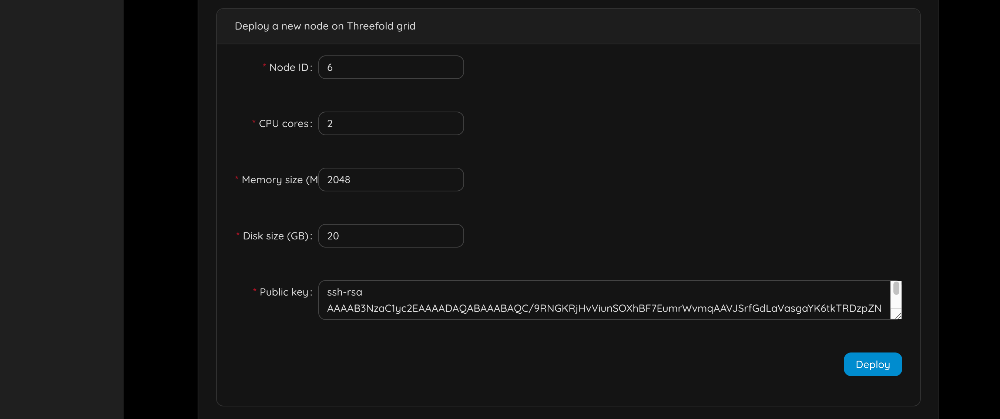
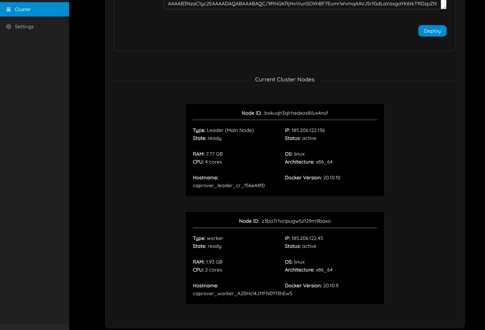

# Manage Caprover

## Step 1: Enable https

You need to specify your email address.

You will have to login again.

> Now force https.

You will have to login again, and you should notice https is now used.

## Step 2: Deploy an app

just go to apps & follow the instructions, there is much more info on caprover website.

## Step 3: Enable monitoring

You should now see

## Step 4: Lets add nodes to caprover

- Go to the settings

- Fill in your mnemonic from TF-Chain, make sure it's the right net you are connected to
- Add your SSH-key

Now go to `Cluster` :

Specify the details of the resources you need and click on `Deploy` :

You should then see something like

This should typically take less than 2 minutes.

> Important: the deployment process takes some time before it is known in CapRover.

Go out of the form and back to `Cluster`. 

## Step 5: Change your password

- Go to `Settings` and change your password. This is important for your own security.   