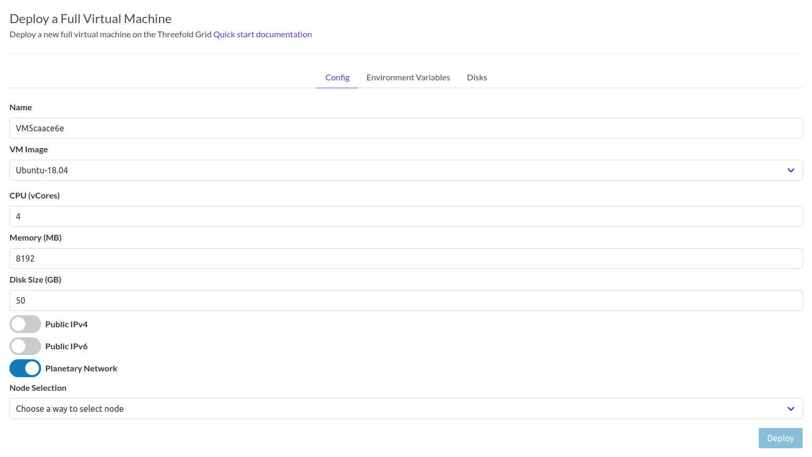
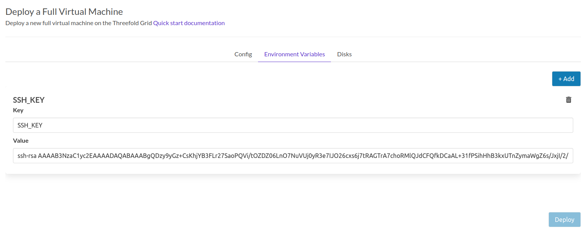
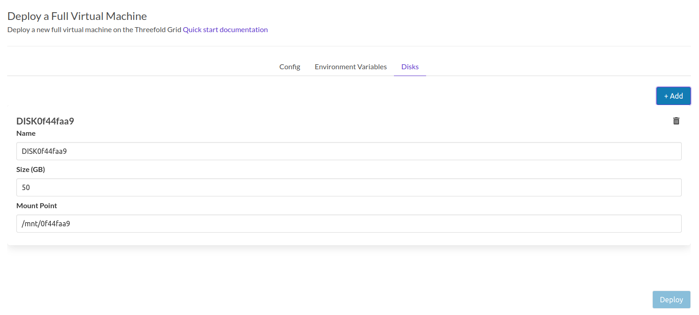

# Full Virtual Machine

Deploy a new full virtual machine on the Threefold Grid

!!!include:weblets_play_go
- Make sure you have an activated [profile](weblets_profile_manager) 
- Click on the **Full Virtual Machine** tab

__Process__ : 



- Fill in the instance name: it's used to reference the VM in the future.
- Choose the image from the drop down (e.g Alpine, Ubuntu) or you can click on `Other` and manually specify the flist URL and the entrypoint. Please note that only cloud init flist that contains a kernel can be deployed on a full VM.
- `Public IPv4` flag gives the full VM a Public IPv4
- `Public IPv6` flag gives the full VM a Public IPv6
- `Planetary Network` to connect the full VM to Planetary network
- Choose the node to deploy on which can be
   - Manual: where you specify the node id yourself
   - Automatic: Suggests nodes list based on search criteria e.g `country`, `farm`, capacity..
  


Clicking on enviornment allows you to define environment variables to pass to the full VM. 
> Note the Public SSH key in the profile is automatically used as variable `SSH_KEY` passed to all Virtual Machines 


You can attach one or more disks to the Full Virtual Machine by clicking on the Disks tab and the plus `+` sign and specify the following parameters
   - Disk name 
   - Disk size
   - Mount point

in the bottom of the page you can see a list of all of the virual machines you deployed. you can click on `Show details` for more details


You can also go to JSON tab for full details


## Difference Between Full Virtual Machine and Micro Virtual Machine
   - Full VM contains a default disk attached to it which is not the case in the Micro VM where you needed to make sure to attach a disk to it or the VM will fail 
   - The default disk is mounted on / so if you want to attach any additional disks, you have to choose a different mounting point
   - Only cloud init flists that already contain a kernal can be deployed on Full VM
   - In FUll VM, you need to mount the additional disks manually after the VM is deployed


## Manually Mounting Additional Disk

   - You can follow the following commands to add your disk manually:


### check all disks attached to the VM
```
fdisk -l

```

### the additional disk won't be mounted and you won't find it listed
```
df -h

```

### create mount dir
```
sudo mkdir /hdd6T

```

### new file system
```
sudo mkfs.ext4 /dev/vdb

```

### mount drive
```
sudo mount /dev/vdb /hdd6T/

```

