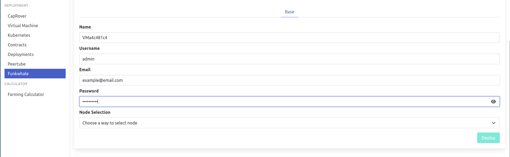
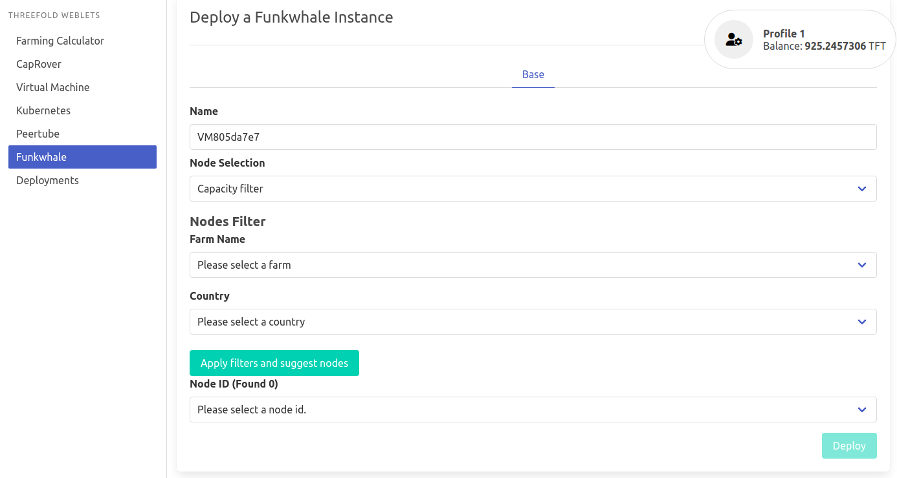

# funkwhale

[Funkwhale](https://funkwhale.audio/) is social platform to enjoy and share music.
Funkwhale is a community-driven project that lets you listen and share music and audio within a decentralized, open network.

- Visit https://play.grid.tf
- Make sure you have an activated [profile](weblets_profile_manager) 
- Click on the **Funkwhale** tab

__Process__ : 

- Enter an Application Name. It's used in generating a subdomain on one of the gateways on the network. Ex. ***myfunk*.gent02.dev.grid.tf**
- Choose a node to deploy your Funkwhale instance on.
    
- Either use the **Capacity Filter**. Which simply lets you pick a *Farm* and *Country*, after clicking on *Apply filters and suggest nodes* then it lists available nodes with these preferences and you pick. 

   
    
- Or use **Manual** and type a specific node number to deploy on.

  

After that is done you can see a list of all of your deployed instances

Click on ***Visit*** to go to the homepage of your Funkwhale instance!
