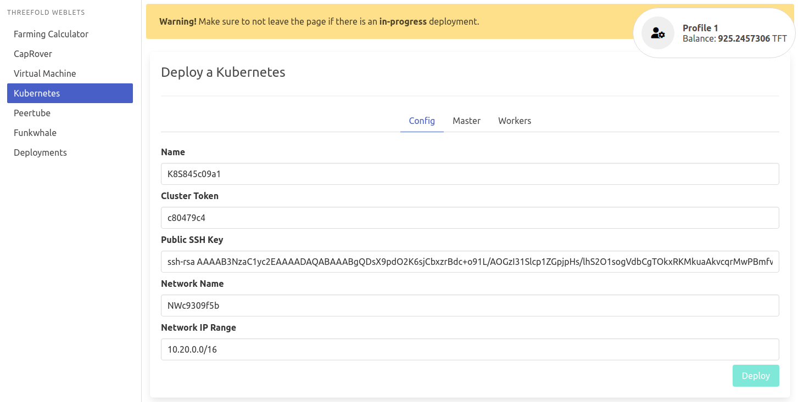
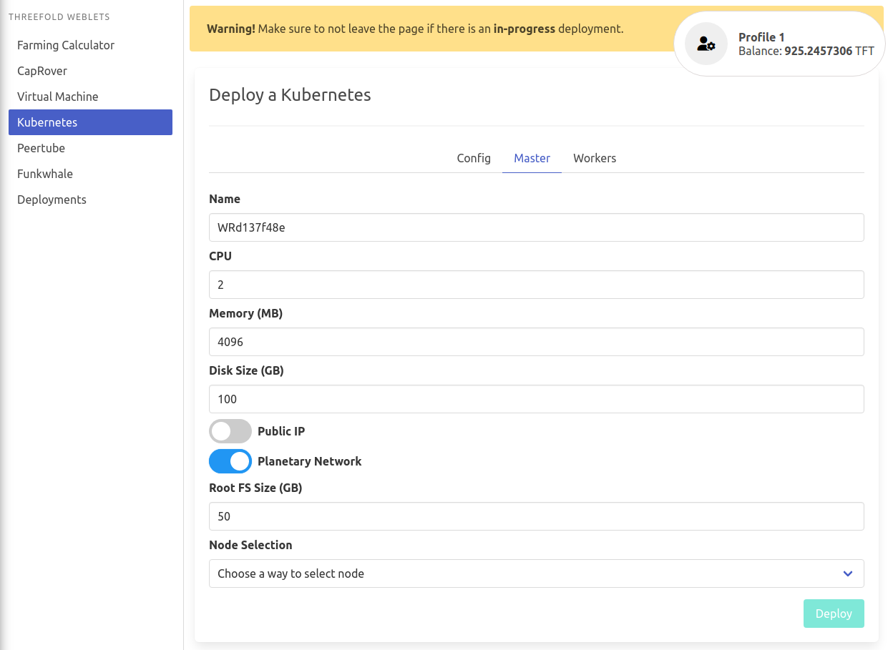
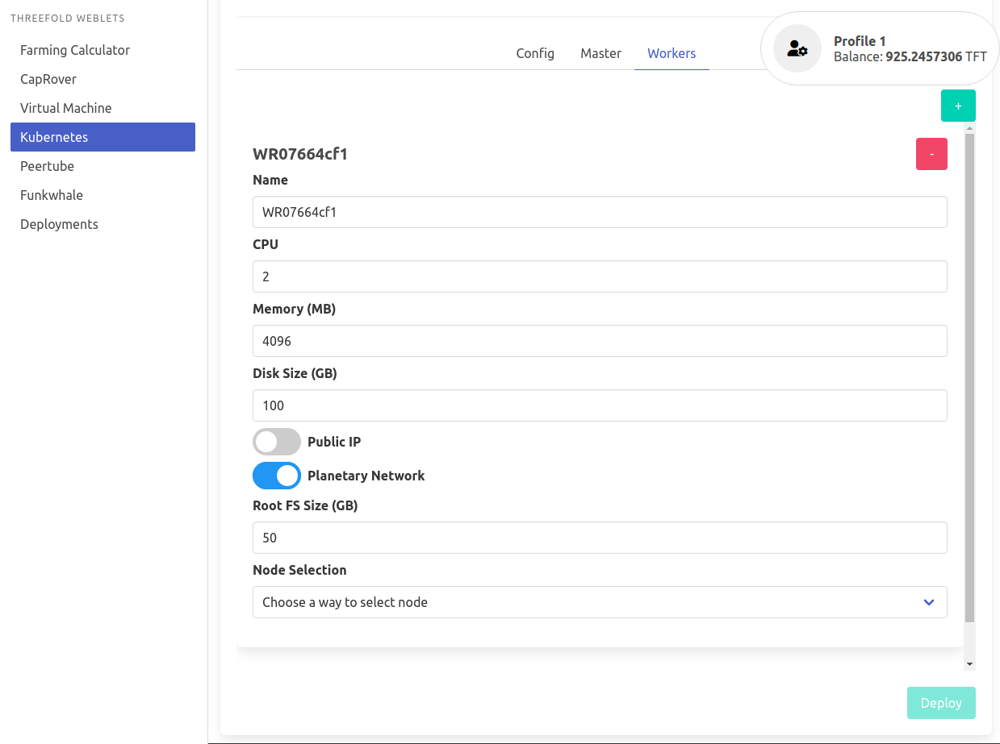

# Kubernetes 

Kubernetes is the standard container orchestration tool.

On the TF grid, Kubernetes clusters can be deployed out of the box. We have implemented [K3S](https://k3s.io/), a full-blown Kubernetes offering that uses only half of the memory footprint. It is packaged as a single binary and made more lightweight to run workloads in resource-constrained locations (fits e.g. IoT, edge, ARM workloads).

- Visit https://play.grid.tf
- Make sure you have an activated [profile](weblets_profile_manager) 
- Click on the **Kubernetes** tab

### **Configs** tab

- `Name`: Your Kubernetes Cluster name.
- `Cluster Token`: It's used for authentication between your worker nodes and master node. You could use the auto-generated one or type your own.
- Your `Public SSH Key` is used to login into VM's, K8s clusters, etc..
- `Network Name`: It's used for Wireguard's private network.
- `Network IP Range`: It's a private subnet for Wireguard's network. You could use the auto-generated one or replace it with a **private** subnet.

### **Master** and **Worker** tabs

> Currently, we only support "single-master-multi-worker" k8s clusters. So you could always add more than one worker node by clicking on the **+** in the ***Worker*** tab.