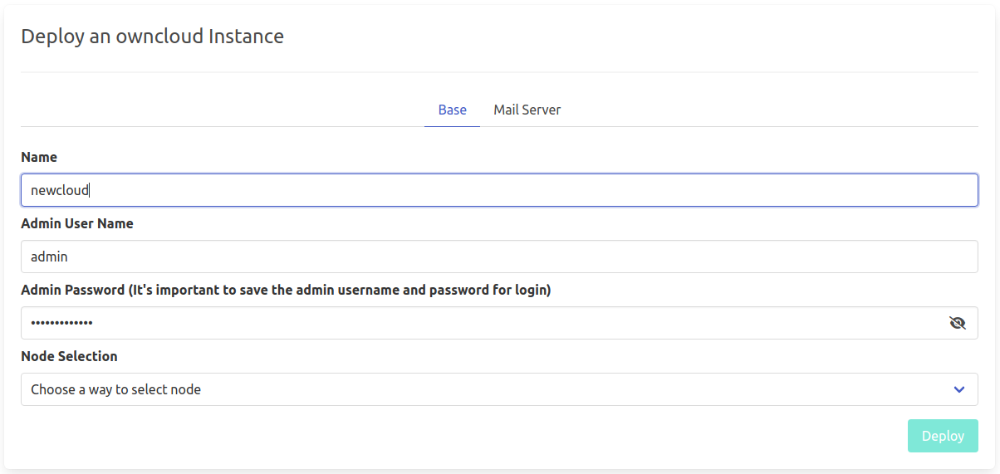

# ownCloud

[ownCloud](https://owncloud.com/) develops and provides open-source software for content collaboration, allowing teams to easily share and work on files seamlessly regardless of device or location.

!!!include:weblets_play_go
- Make sure you have an activated [profile](weblets_profile_manager)
- Click on the **Owncloud** tab

__Process__ :

- Enter an Application Name. It's used in generating a unique subdomain on one of the gateways on the network alongside your twin ID. Ex. ***oc98newcloud*.gent02.dev.grid.tf**

- Enter administrator information including **Username** and **Password**. This admin user will have full permission on the deployed instance.

- Select a capacity package:
    - **Minimum**: { cpu: 2, memory: 1024 * 16, diskSize: 250 }
    - **Standard**: { cpu: 2, memory: 1024 * 16, diskSize: 500 }
    - **Recommended**: { cpu: 4, memory: 1024 * 16, diskSize: 1000 }
    - Or choose a **Custom** plan
- Choose a gateway node to deploy your Owncloud instance on.

- Select a node to deploy your OwnCloud instance on.

    - Either use the **Capacity Filter**. Which simply lets you pick a *Farm* and *Country*, after clicking on *Apply filters and suggest nodes* then it lists available nodes with these preferences and you pick.

    - Or use **Manual** and type a specific node number to deploy on.

There's also an optional **Mail Server** tab if you'd like to have your Owncloud instance configured with an SMTP server.

After that is done you can see a list of all of your deployed instances

Click on ***Visit*** to go to the homepage of your Owncloud instance! 

<h3>Login with ThreeFold Connect App</h3>

If you'd like to be able to use TFConnect to login, click the **TF Connect** button on the login page first and proceed with the login using your ThreeFold Connect app. You will be shown a message saying *User disabled, please contact the administrator to enable this account*. Next you need to login to the Owncloud web interface using your admin username and password to allow TFConnect login for your user from within the user settings (those can be found on the top right of the UI). Once you're on the User page, locate the Settings button (on the bottom left of the screen) and click it. You will be shown a list of checkboxes. Activate the checkbox with the label *show enabled/disabled option*. Finally you need to find your 3bot user in the list of users (on the same page) and check the *enabled* checkbox. Now go back to the login page and login with your user using the ThreeFold Connect app.

