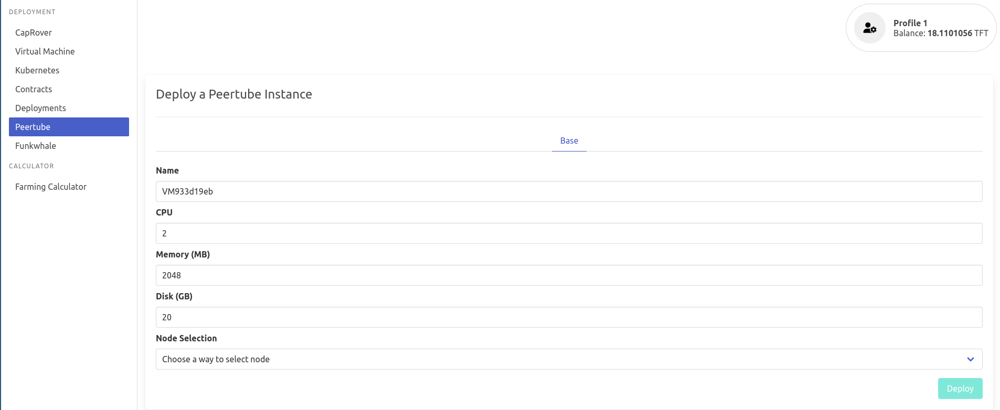
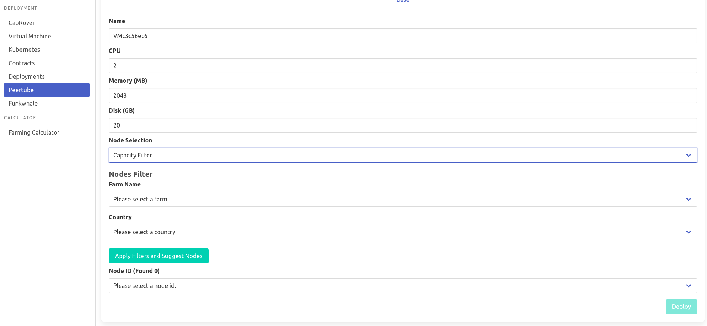

# Peertube

[Peertube](https://joinpeertube.org/) aspires to be a decentralized and free/libre alternative to video broadcasting services.

!!!include:weblets_play_go
- Make sure you have an activated [profile](weblets_profile_manager)
- Click on the **Peertube** tab

__Process__

- Enter an Application Name. It's used in generating a unique subdomain on one of the gateways on the network alongside your twin ID. Ex. ***pt100peerprod*.gent02.dev.grid.tf**

- Enter required capacity for this Peertube instance, **Disk** will be the storage capacity for videos. Better to have a look at this [FAQ](https://joinpeertube.org/faq#should-i-have-a-big-server-to-run-peertube) for more insights about server requirements.

- Choose a node to deploy your Peertube instance on.

- Either use the **Capacity Filter**. Which simply lets you pick a *Farm* and *Country*, after clicking on *Apply filters and suggest nodes* then it lists available nodes with these preferences and you pick.

- Or use **Manual** and type a specific node number to deploy on.

After that is done you can see a list of all of your deployed instances

Click on ***Visit*** to go to the homepage of your Peertube instance!

> Please note it may take sometime to be ready
