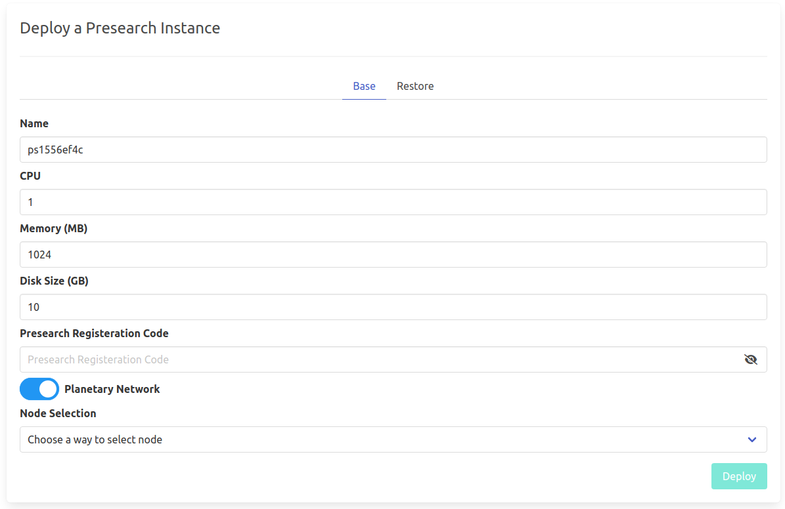
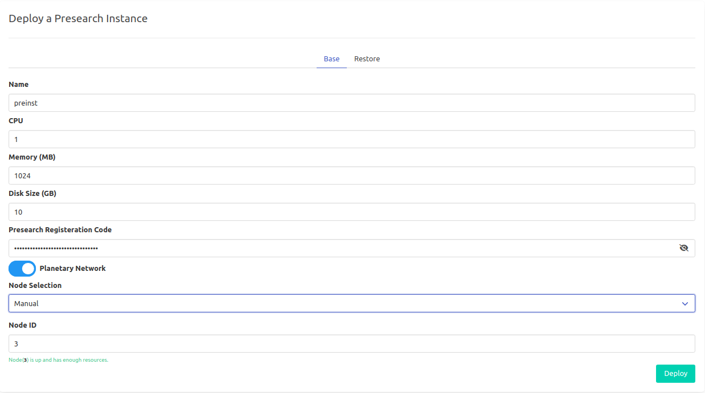

# Presearch

[Presearch](https://www.presearch.io/)is a community-powered, decentralized search engine that provides better results while protecting your privacy and rewarding you when you search.

!!!include:weblets_play_go
- Make sure you have an activated [profile](weblets_profile_manager)
- Click on the **Presearch** tab

__Process__

- Enter an instance name, specs for memory and disk size you'll need.

- You need to sign up on Presearch in order to get your *Presearch Registeration Code*. To sign up, go to [Presearch](https://presearch.org/), create your account and then head to your [dashboard](https://nodes.presearch.org/dashboard) to find your registration code.
  
- Choose a node to deploy your Presearch instance on.

- Either use the **Capacity Filter**. Which simply lets you pick a *Farm* and *Country*, after clicking on *Apply filters and suggest nodes* then it lists available nodes with these preferences and you pick.

- Or use **Manual** and type a specific node number to deploy on.

## Now what if you already have a Presearch node deployed somewhere and would like to migrate to Threefold?

We got you! All you need to do is:

1. Login to your old server that has your node via SSH.
2. Run `docker cp presearch-node:/app/node/.keys presearch-node-keys` in order to generate your key-pair.
3. Head to the *Restore* tab in the Presearch weblet and paste your key-pair in the fields below and you'll be good to deploy!

After that is done you can see a list of all of your deployed instances

Now if you had to your [dashboard](https://nodes.presearch.org/dashboard)again and scroll down to **Current Nodes**, you'll see your newly created node up and connected!

You should visit Presearch's [docs](https://docs.presearch.org/)if you want to learn more!