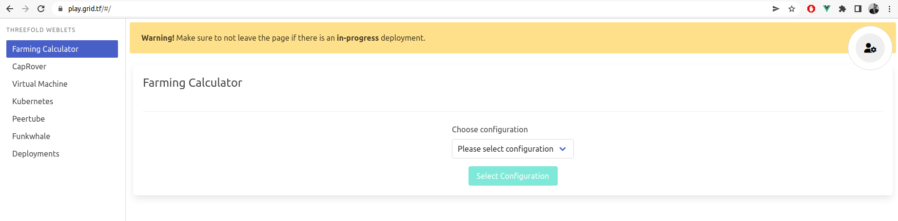
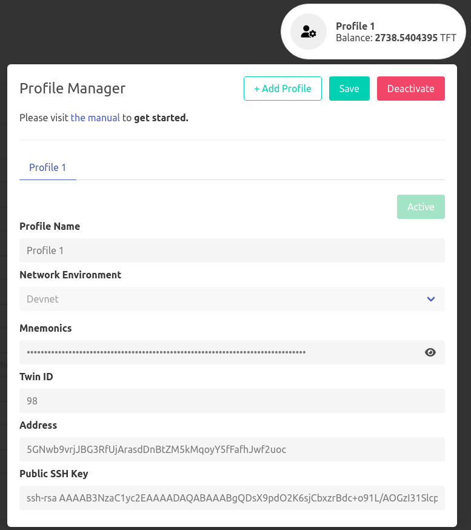

# Profile Manager

- Go to https://play.grid.tf

Start by creating a profile from the upper right button. This creates a profile, saved and encrypted locally in your browser.

### Secure 

The **Profile Manager Password** is how you store your profile info locally, in your browser. So you shouldn't be sharing it with anyone and always remember it. Create a new profile by visiting the **Create Profile Manager** tab and enter your new password. After you're done, click on **Create New Profile Manager**. 

You'll need that password to be able to load your profiles afterwards from the **Activate Profile Manager** tab.

### Process

Start entering the following information required to create your new profile.

- `Profile Name`: Any chosen name, makes it easy for you to remember between sessions.
- `Network Environment` : Choose the network you want to use.
- `Mnemonics` are the secret words of your Polkadot account, [Generate yours here!](tfchain_portal_polkadot_create_account). 
- Your `Public SSH Key` is used to login into VM's, Kubernetes, ... 

After you finish typing your credentials, click on **Activate**. Once your profile gets activated, you should find your **Twin ID** and **Address** generated under your ***Mnemonics*** for verification. Also, your **Account Balance** will be available at the top right corner under your profile name. 

