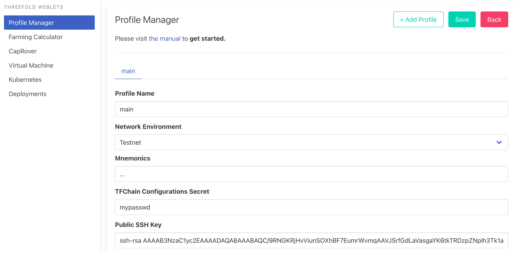

# weblets_profile_manager

- go to https://play.grid.tf
- Click on Profile manager

Process

- fill in the secret you want to use to remember your profile information (do not forget please)

- profile name: any chosen name, makes it easy for you to remember between sessions.
- Choose which network to use
- Mnemonics, is your secret key of your polkadot account, [see here how to create](tfchain_portal_polkadot_create_account)
- You passwd as is used to store info on the TFChain
- Your public ssh key, used to login into VM's, Kubernetes, ... 

