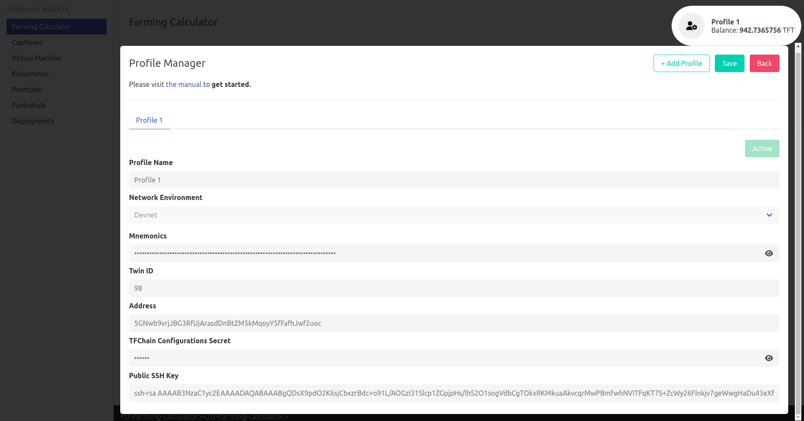

# weblets_profile_manager

- Go to https://play.grid.tf

Start by creating a profile from the upper right button. This creates a profile, saved and encrypted locally in your browser.

## Secure 

The **Browser Session Secret** is how you store your profile info locally, in your browser. So you shouldn't be sharing it with anyone and always remember it. After you're done typing your secret, click on **Create a New Store**.

## Process

- `Profile Name`: Any chosen name, makes it easy for you to remember between sessions.
- `Network Environment` : Choose the network you want to use.
- `Mnemonics` are the secret words of your Polkadot account, [Generate yours here!](tfchain_portal_polkadot_create_account). 
- `TF Configuration Secret` is the password used to store info on the TFChain
- Your `Public SSH Key` is used to login into VM's, Kubernetes, ... 

After you finish typing your credentials, click on **Activate**. Once your profile gets activated, you should find your **Twin ID** and **Address** generated under your ***Mnemonics*** for verification.

