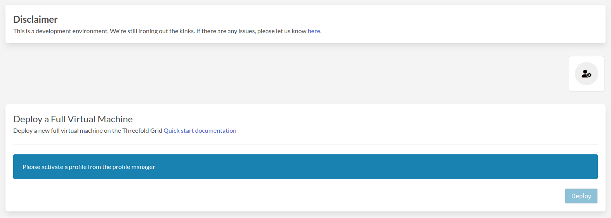

# Profile Manager

Currently, we're supporting four different networks.

- One for development purposes (Devnet) where you can find it at https://play.dev.grid.tf
- One for internal testing and verifications (QAnet) where you can find it at https://play.qa.grid.tf
- One for testing (Testnet) where you can find it at https://play.test.grid.tf
- One for our mainnet and you can find it at https://play.grid.tf

Start by click the profile manager icon to open the profile manager window.

- Fields
  - `Mnemonics` are the secret words of your Polkadot account.
  - Your `Public SSH Key` is used to login into VM's, Kubernetes, ...
- Actions
  - `Migrate` clicking this button will toggle **migration** mode.
    > **Note:** More info next section.
  - `Create Account` clicking this button will create a new account on the current network and create a twin for you.
  - `Generate SSH Keys` clicking this button will generate a public & private ssh keys.
    > **Note:** Private key will be downloaded directly.

Migrate basically allows you to transfer your keys from the old profile manager into the new one to be able to see your old deployments. All you need to do is enter your old profile's password and click migrate.

### Keep Deployment Alive

With the [release](https://github.com/threefoldtech/home/blob/master/wiki/products/v3/tfgrid_3.6.1.md) of ThreeFold Grid 3.6.1 on mainnet, the team implemented a new feature for [Zero-OS](https://github.com/threefoldtech/home/blob/master/wiki/products/v3/tfgrid_3.6.1.md#zos-v310). It now supports a function for **pausing workloads for up to two weeks** before cancelling the contract.

This means that if the wallet paying for a workload runs out of [TFT](https://forum.threefold.io/t/what-is-the-real-value-of-tft/3143?u=hannahcordes), it will get paused for a maximum period of two weeks but not deleted. During this time, you will not be able to access the workload. Simply **add a sufficient amount of tokens to the wallet to cover the costs of the workload**, and it will be resumed. In case the connected wallet doesn’t receive sufficient funds within the two-week grace period, the contract gets cancelled and the workload gets deleted.

### How to calculate deployment costs

With Grid V3, we implemented a **post-billing system**, so you will get billed for the utilized capacity after deploying the workload. The simplest way to estimate your workload’s cost is to deploy on the [TF Playground](https://library.threefold.me/info/manual/#/manual__weblets_home?id=playground) and wait until the **TFT per hour** field fills in. Based on this number, you can calculate your workload’s future costs. Also, you can find the costs per CU/SU/NU [here](https://library.threefold.me/info/threefold#/cloud/threefold__pricing).

### How to know when you’re running out of funds

There are several ways to figure out if your wallet is running out of funds. Simply check your wallet in the TF Connect app or go to the [TF Chain Portal](https://portal.grid.tf/#/) to check on your account balance.

If you’d like something more advanced, there are some command line tools that allow you to write a small script for monitoring your balance and notifying you on Telegram. Also, @scott will create a bot similar to the [node status bot](https://forum.threefold.io/t/announcing-the-node-status-bot-for-telegram/1880?u=hannahcordes), so you can subscribe to a given wallet address and receive alerts when it's running low – stay tuned!
