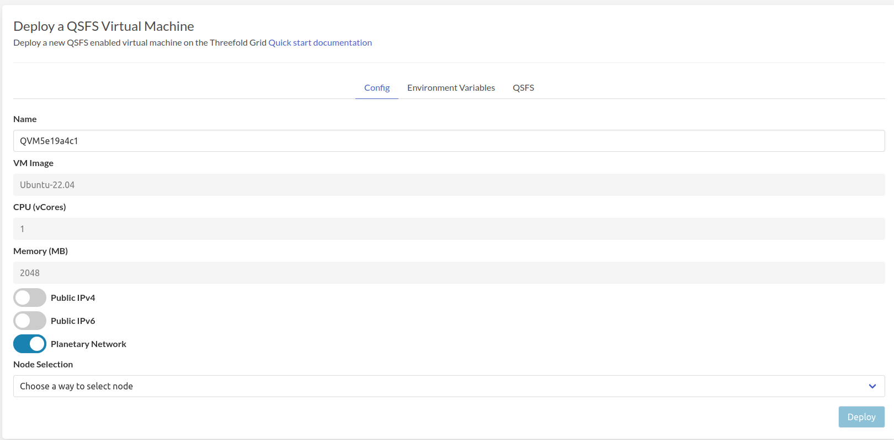

# QSFS Virtual Machine

Deploy a new virtual machine wiht QFSF on the Threefold Grid

!!!include:weblets_play_go
- Make sure you have an activated [profile](weblets_profile_manager) 
- Click on the **QFSF Virtual Machine** tab

__Process__ : 

- Fill in the instance name: it's used to reference the VM in the future.
- For now the QVM comes with 
  -  Ubuntu-22.04 image
  -  1 CPU 
  -  2 GB RAM
- `Public IPv4` flag gives the QSFS virtual machine a Public IPv4
- `Public IPv6` flag gives the QSFS virtual machine a Public IPv6
- `Planetary Network` to connect the QSFS Virtual Machine to Planetary network
- Choose the node to deploy on which can be
   - Manual: where you specify the node id yourself
   - Automatic: Suggests nodes list based on search criteria e.g `country`, `farm`, capacity..
