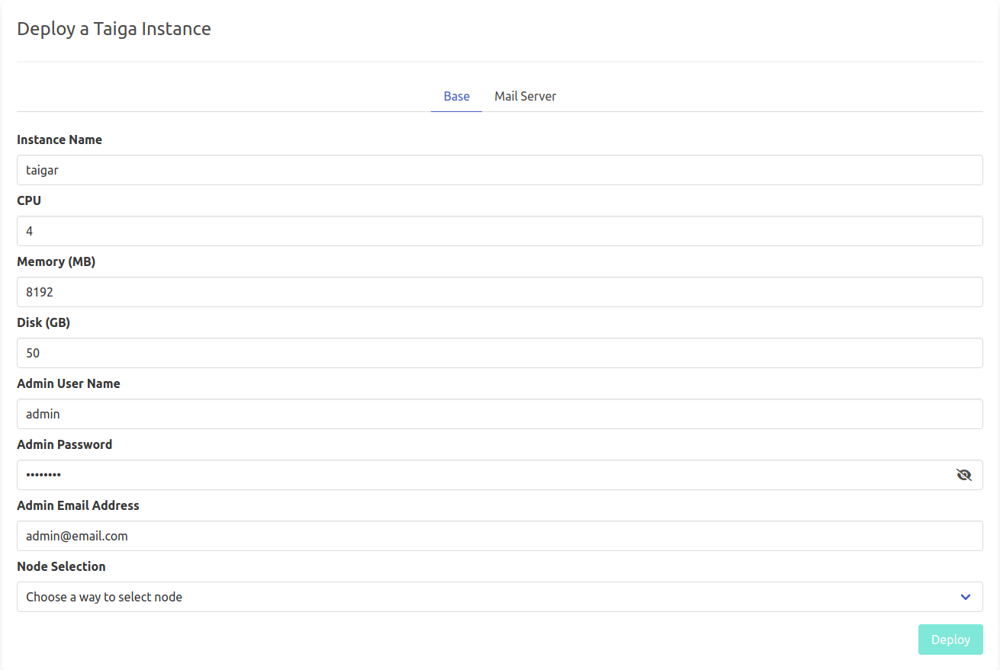

# Taiga

[Taiga](https://funkwhale.audio/) is social platform to enjoy and share music.
Funkwhale is a community-driven project that lets you listen and share music and audio within a decentralized, open network.

!!!include:weblets_play_go
- Make sure you have an activated [profile](weblets_profile_manager)
- Click on the **Taiga** tab

__Process__ :

- Enter an Application Name. It's used in generating a unique subdomain on one of the gateways on the network alongside your twin ID. Ex. ***tg98myfunk*.gent02.dev.grid.tf**

- Enter administrator information including **Username**, **Email** and **Password**. This admin user will have full permission on the deployed instance.

- Choose a node to deploy your Funkwhale instance on.

- Either use the **Capacity Filter**. Which simply lets you pick a *Farm* and *Country*, after clicking on *Apply filters and suggest nodes* then it lists available nodes with these preferences and you pick.

- Or use **Manual** and type a specific node number to deploy on.

There's also an optional **Mail Server** tab if you'd like to have your Taiga instance configured with an SMTP server.

After that is done you can see a list of all of your deployed instances

Click on ***Visit*** to go to the homepage of your Funkwhale instance!

