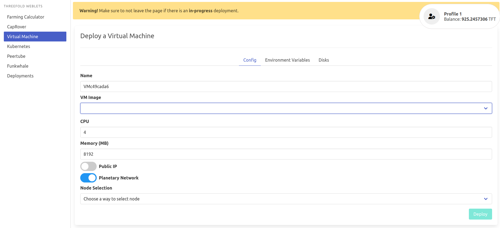

# Virtual Machine

Deploy a new virtual machine on the Threefold Grid

!!!include:weblets_play_go
- Make sure you have an activated [profile](weblets_profile_manager) 
- Click on the **Virtual Machine** tab

__Process__ : 

- Fill in the instance name: it's used to reference the VM in the future.
- Choose the image from the drop down (e.g Alpine, Ubuntu) or you can click on `Other` and manually specify the flist URL and the entrypoint.
- `Public IP` flag gives the Virtual machine a public IP 
- `Planetary Network` to connect the Virtual Machine to Planetary network
- Choose the node to deploy on which can be
   - Manual: where you specify the node id yourself
   - Automatic: Suggests nodes list based on search criteria e.g `country`, `farm`, capacity..
  

Clicking on enviornment allows you to define environment variables to pass to the virtual machine. 
> Note the Public SSH key in the profile is automatically used as variable `SSH_KEY` passed to all Virtual Machines 

You can attach one or more disks to the Virtual Machine by clicking on the Disks tab and the plus `+` sign and specify the following parameters
   - Disk name 
   - Disk size
   - Mount point

in the bottom of the page you can see a list of all of the virual machines you deployed. you can click on `Show details` for more details

You can also choose json option for full details

> Deletion happens sequentially, you can only delete one at a time.

